# AOI Review Workstation

An Automatic Optical Inspection (AOI) workstation for PCB review, setup validation, and event logging. This repository combines a FastAPI backend, a React review interface, SQLite persistence, and an observability stack for inspecting runs from image upload through defect review.


## Overview

The current project state includes:

- A FastAPI service for run creation, image upload, event ingestion, and run review APIs
- A React-based AOI review workstation with run history, defect filters, image viewer controls, and settings
- Setup-stage workflow support for model selection, fiducial detection, barcode handling, and review readiness
- Automatic component-candidate detection on uploaded PCB scans, with persisted overlays in setup and review
- SQLite-backed storage for `inspection_runs`, `defect_logs`, and uploaded scan assets
- JSONL event logging for downstream observability pipelines
- A local Docker stack with Grafana, Loki, and Promtail

## Thesis Focus

The current thesis direction for this repository is:

- monitoring AI inference behavior in an AOI workflow
- capturing structured inference events
- shipping logs through Promtail and Loki
- visualizing operational behavior in Grafana
- evaluating anomaly scenarios such as elevated fail rate, latency spikes, and
  recovery

The AOI workstation and backend are already functional enough to support this
observability story end to end.

Core thesis-supporting documents:

- [Thesis draft](docs/paper/thesis.latex)
- [Anomaly testing plan](docs/anomaly_testing.md)
- [System overview](docs/ai_system.md)
- [Architecture note](docs/architecture.md)
- [Testing protocol](docs/testing.md)

## Supporting ML Workstream

The repository also contains a separate ML workstream for eventual replacement
of mock inference with a real PCB model backend. This is supporting work for the
platform, not the primary thesis claim.

Current ML snapshot:

| Item | Current Value |
| --- | --- |
| Task | `component_detection` |
| Dataset profile | `reduced` |
| Active classes | `resistor`, `capacitor`, `connector`, `ic`, `led`, `other` |
| Dataset split | `470 train / 102 val / 100 test` |
| Latest test `mAP@50` | `0.1346` |
| Latest test `mAP@50-95` | `0.0687` |
| Latest test precision | `0.1602` |
| Latest test recall | `0.2452` |
| Best current class | `ic` (`AP50 = 0.461`) |
| Current limitation | dense small parts still suppress `resistor` and `led` performance |

Important boundary:

- these ML results are internal engineering baselines
- they are useful for future real-inference integration
- they are not the central evidence for the monitoring thesis

Supporting ML references:

- [Project progress](docs/project_progress.md)
- [ML pipeline README](ml/README.md)
- [Component baseline assessment](docs/component_baseline_assessment.md)
- [Larger-seed evaluation report](ml/reports/component_detection/20260531-170800Z-evaluate.md)

## Anomaly Detection & Monitoring Evaluation

This is the primary thesis evaluation chapter — *"Design and Evaluation of an AI Model
Logging and Monitoring System Using the Loki Stack."* The question it answers is:
**when an AI inference service starts behaving abnormally in production, does the
logging/monitoring stack actually surface it?**

To answer that, the repo ships a reproducible experiment suite under
[`experiments/`](experiments/) that injects nine distinct anomaly patterns into the
live `POST /events` pipeline. Each event is written to JSONL, scraped by Promtail,
stored in Loki, and visualised in a dedicated Grafana dashboard
([`aoi-anomaly-detection.json`](deploy/grafana/provisioning/dashboards/json/aoi-anomaly-detection.json))
with three provisioned alert rules
([`aoi-alerts.yml`](deploy/grafana/provisioning/alerting/aoi-alerts.yml)).

```bash
# 1. bring up the stack (API + Loki + Promtail + Grafana)
docker compose up -d --build
# 2. run every anomaly scenario (~13 min, 9 scenarios back to back)
python -m experiments.runner
# 3. generate a Loki-backed markdown report
python -m experiments.report --output docs/experiments/anomaly_results.md
```

> All screenshots below are **live Grafana captures** taken via headless Chromium
> after running the suite (June 2026). Each scenario isolates its own data by `pcb_id`
> prefix, so every panel shows exactly one anomaly pattern. Raw captures live in
> [docs/pics/anomaly-screenshots/](docs/pics/anomaly-screenshots/); the machine-generated
> Loki report is [docs/experiments/anomaly_results.md](docs/experiments/anomaly_results.md).

### Headline dashboard — an anomaly in progress

<p align="center">
  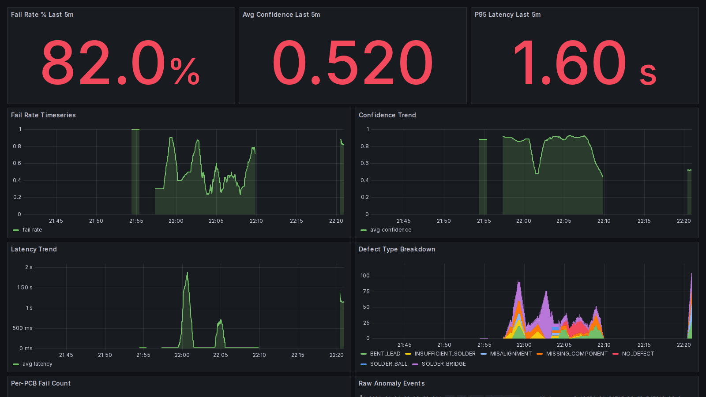
</p>

- **What:** The `AOI Anomaly Detection` dashboard captured while an anomaly was actively
  running. The three stat tiles read **82.0% fail rate**, **0.520 avg confidence**, and
  **1.60s P95 latency** — all in the red. The timeseries below replay the full
  experiment timeline: the Fail-Rate, Confidence, and Latency panels each carry a
  distinct anomaly signature, and the Defect-Type Breakdown shows which fault dominated when.
- **Why:** A single screen has to tell an operator *"something is wrong right now"* before
  they read a single log line. Stat tiles answer the binary question; the trend panels
  answer *"since when, and getting better or worse?"*
- **How:** Stat tiles use instant LogQL over a `[5m]` window
  (`sum(count_over_time(... FAIL ...)) / sum(count_over_time(...)) * 100`); the trend panels
  use `avg(avg_over_time(... | json | unwrap <field> [1m]))`. The `unwrap` aggregations are
  wrapped in `avg()`/`max()` so a metric collapses to one clean series instead of one line
  per log stream.

### Alerts actually fire

<p align="center">
  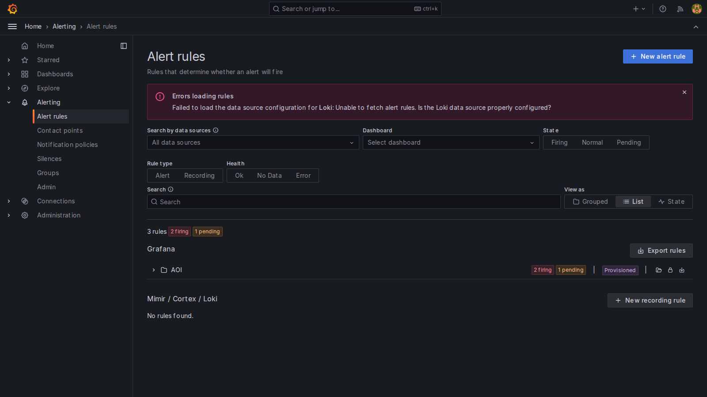
</p>

- **What:** Grafana Alerting during the same window: **3 rules, 2 firing, 1 pending**. The
  high-defect-rate and latency rules have crossed their thresholds and fired; the
  low-confidence rule is still counting down its longer `2m` `for:` window.
- **Why:** Dashboards are pull-based — somebody has to be looking. Alert rules are push-based
  and are what turn "observability" into "monitoring." Proving the rules transition to
  *Firing* under a real anomaly is the core thesis claim.
- **How:** Three rules are provisioned as code, each a 3-stage pipeline — a Loki range query
  (`A`) → `reduce` to a single value (`B`) → `threshold` (`C`): fail rate `> 0.6`, avg
  latency `> 500ms`, avg confidence `< 0.6`, with `for:` debounce windows of 1–2 minutes.

### The nine scenarios

Each scenario maps to one thesis sub-section. The result image is the isolated Grafana
graph for that `pcb_id` range.

#### S01 — Normal Baseline (the control)

<p align="center">
  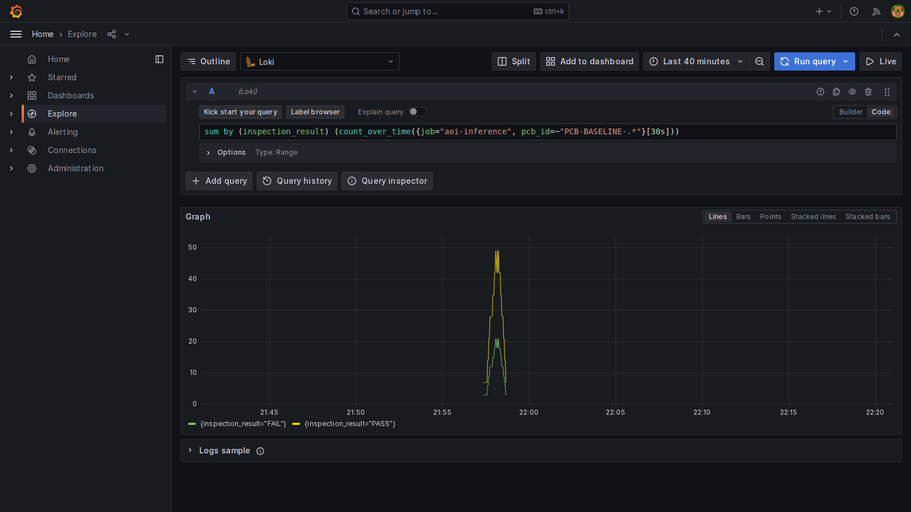
</p>

- **What:** A healthy line: PASS (yellow) peaks near 48 while FAIL (green) sits around 20 —
  the natural ~70/30 ratio with 20–45ms latency and 0.75–0.99 confidence.
- **Why:** Every anomaly claim is relative. Without a documented "normal," a 60% fail rate is
  just a number; against this baseline it is unambiguously abnormal.
- **How:** `sum by (inspection_result) (count_over_time({job="aoi-inference", pcb_id=~"PCB-BASELINE-.*"}[30s]))`.

#### S02 — High Defect-Rate Spike

<p align="center">
  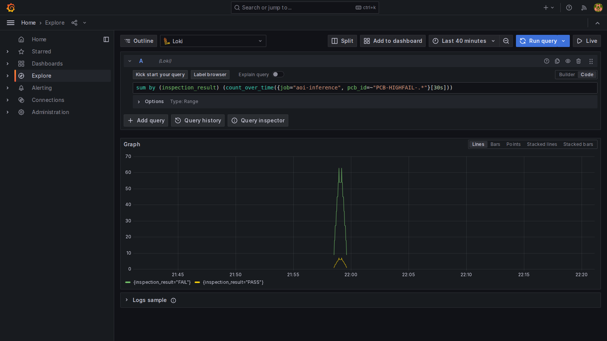
</p>

- **What:** The inverse of S01 — FAIL (green) spikes to ~63 while PASS (yellow) barely
  reaches 5. An >80% defect rate, the canonical "production line just went bad" event.
- **Why:** A sudden defect-rate jump is the most common real AOI failure mode (a bad reel, a
  mis-calibrated placement head). It must be caught within one scrape interval.
- **How:** Same LogQL as S01 over `PCB-HIGHFAIL-.*`; this is the pattern that trips the
  `fail rate > 0.6` alert.

#### S03 — Latency Spike

<p align="center">
  
</p>

- **What:** Predictions stay correct but inference time ramps from ~250ms to **~2000ms** —
  a clean escalating curve.
- **Why:** Latency drift is the early-warning sign of resource contention, a model-reload
  loop, or GPU starvation — invisible to accuracy metrics but fatal to throughput.
- **How:** `avg(avg_over_time({... pcb_id=~"PCB-LATENCY-.*"} | json | unwrap inference_latency_ms [30s]))`;
  trips the `avg latency > 500ms` alert.

#### S04 — Low-Confidence Storm

<p align="center">
  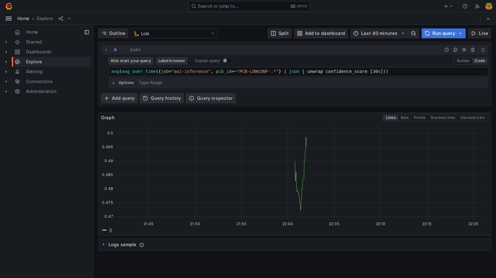
</p>

- **What:** Confidence collapses and stays pinned in the **0.47–0.50** band — far below the
  0.6 threshold.
- **Why:** Uniformly low confidence is the fingerprint of out-of-distribution input — a board
  variant the model never trained on. Surfacing it lets operators flag boards for manual
  re-inspection instead of trusting a guess.
- **How:** `avg(avg_over_time({... pcb_id=~"PCB-LOWCONF-.*"} | json | unwrap confidence_score [30s]))`;
  trips the `avg confidence < 0.6` alert.

#### S05 — Single Defect-Type Flood

<p align="center">
  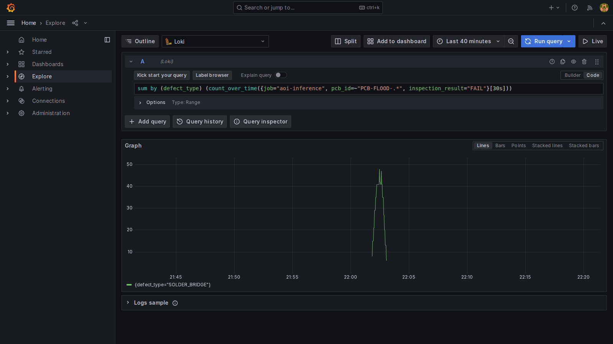
</p>

- **What:** Exactly one series in the legend — `{defect_type="SOLDER_BRIDGE"}`. Every other
  defect type is flat/absent.
- **Why:** When 100% of failures are the *same* defect, the root cause is systematic
  (e.g. a bad solder-paste batch), not random board quality. That distinction changes the
  operator's response from "scrap the board" to "stop the line."
- **How:** `sum by (defect_type) (count_over_time({... pcb_id=~"PCB-FLOOD-.*", inspection_result="FAIL"}[30s]))`
  — the `defect_type` label does the isolation with no full-text search.

#### S06 — Entire-Board Failure

<p align="center">
  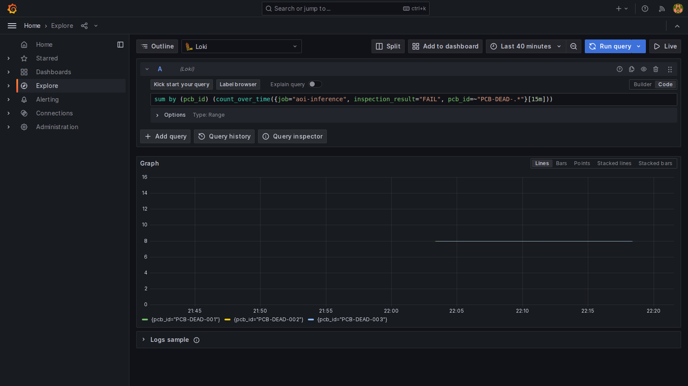
</p>

- **What:** Three overlapping series — `PCB-DEAD-001/002/003` — each pinned at exactly **8**:
  every one of the 8 components on those boards failed, while surrounding boards stayed clean.
- **Why:** Per-board isolation proves the monitoring can answer *"which physical board?"* — a
  single Loki query returns all 8 defect events for one PCB.
- **How:** `sum by (pcb_id) (count_over_time({... inspection_result="FAIL", pcb_id=~"PCB-DEAD-.*"}[15m]))`,
  driven by the `pcb_id` label Promtail extracts from every line.

#### S07 — System Recovery

<p align="center">
  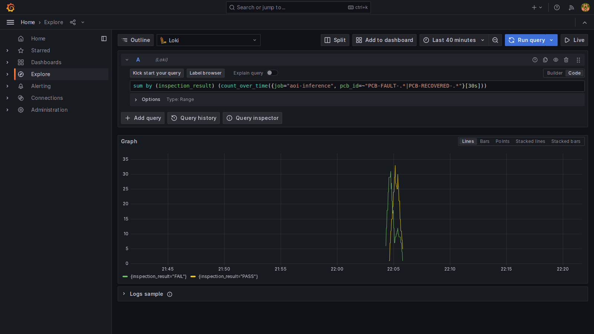
</p>

- **What:** A two-phase shape: FAIL (green) dominates during the fault phase, then PASS
  (yellow) takes over as the line recovers.
- **Why:** Monitoring has to capture the *whole* lifecycle — onset, peak, and resolution —
  so that an alert correctly transitions Firing → Resolved and an operator can confirm a fix worked.
- **How:** `sum by (inspection_result) (count_over_time({... pcb_id=~"PCB-FAULT-.*|PCB-RECOVERED-.*"}[30s]))`.

#### S08 — Intermittent Faults

<p align="center">
  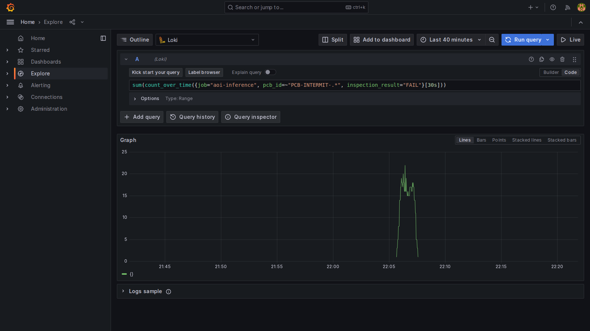
</p>

- **What:** FAILs appear only in short, isolated bursts against an otherwise-zero baseline —
  not a continuous anomaly.
- **Why:** Low-frequency faults average out to "normal" in a 5-minute aggregate stat but are
  the hardest and most important to catch. They show why **log-level** storage beats simple counters.
- **How:** `sum(count_over_time({... pcb_id=~"PCB-INTERMIT-.*", inspection_result="FAIL"}[30s]))`
  over a narrow window exposes the bursts a coarse stat tile would hide.

#### S09 — Gradual Model Degradation

<p align="center">
  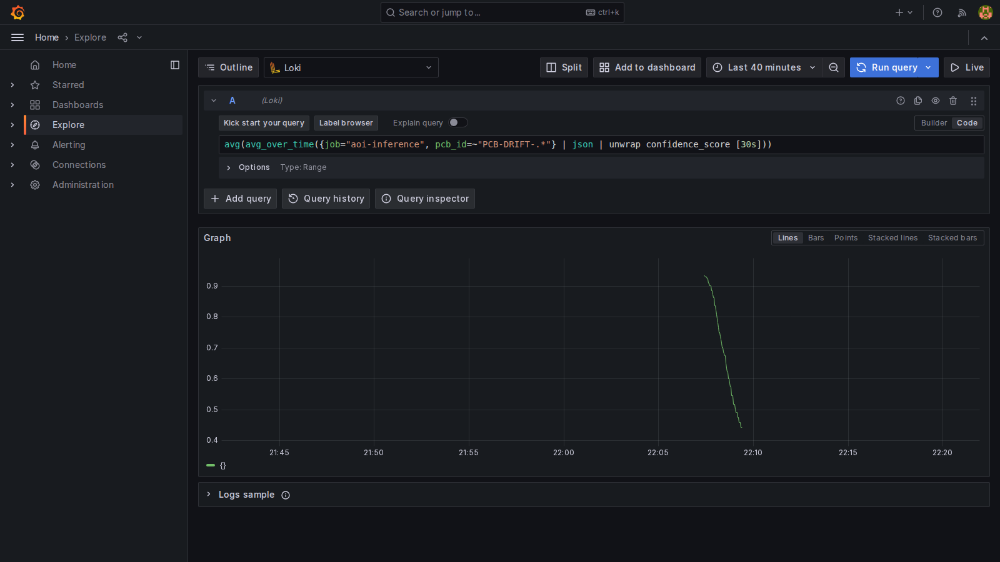
</p>

- **What:** A clean downward slope — average confidence drifts from **~0.95 to ~0.42** over
  the run.
- **Why:** Real model rot is gradual (dataset shift over weeks), not a sudden spike. Catching a
  *trend* rather than a threshold breach is what makes the system suitable for long-term
  production model-health tracking — the most academically interesting case.
- **How:** `avg(avg_over_time({... pcb_id=~"PCB-DRIFT-.*"} | json | unwrap confidence_score [30s]))`.

### Scenario → thesis mapping

| Scenario | Anomaly class | Detection mechanism | Result |
| --- | --- | --- | --- |
| S01 | Healthy baseline | label counts | control ~70/30 PASS/FAIL |
| S02 | Defect-rate spike | `fail_rate > 0.6` alert | >80% fail, **alert fired** |
| S03 | Latency spike | `avg_latency > 500ms` alert | 250ms → 2000ms, **alert fired** |
| S04 | Confidence collapse | `avg_confidence < 0.6` alert | pinned 0.47–0.50 |
| S05 | Systematic single fault | `defect_type` label filter | 100% `SOLDER_BRIDGE` |
| S06 | Board-level failure | `pcb_id` label filter | 3 boards × 8/8 fails |
| S07 | Fault → recovery | timeseries lifecycle | V-shaped recovery |
| S08 | Intermittent burst | narrow-window LogQL | isolated bursts |
| S09 | Gradual drift | trend over time | confidence 0.95 → 0.42 |

## Current UI

> All screenshots below are live captures from the running application (June 2026).

### Review Workspace

<p align="center">
  
</p>

<p align="center">
  <em>Full review workspace: run history rail (left), defect list sidebar, PCB viewer with component and defect overlays, and the floating Defect Inspector (bottom-right) showing component ID, defect type, severity, confidence, and inference latency.</em>
</p>

### Defect Selection and Inspector

<p align="center">
  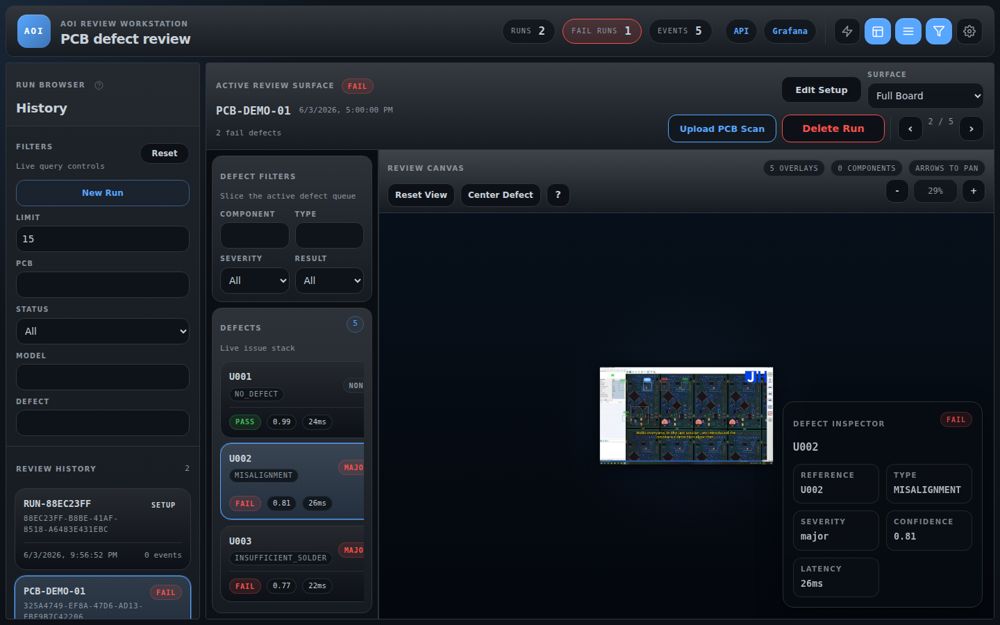
  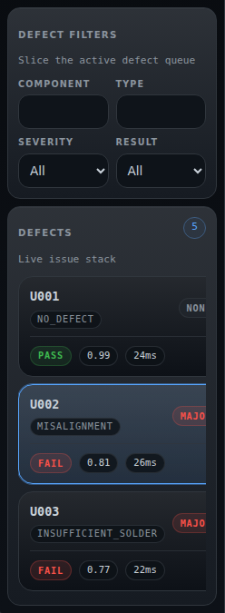
</p>

<p align="center">
  <em>Left: selecting a FAIL defect focuses the overlay and surfaces the inspector. Right: each defect card in the sidebar now shows confidence score and inference latency (ms) side by side.</em>
</p>

### Keyboard Shortcuts Overlay

<p align="center">
  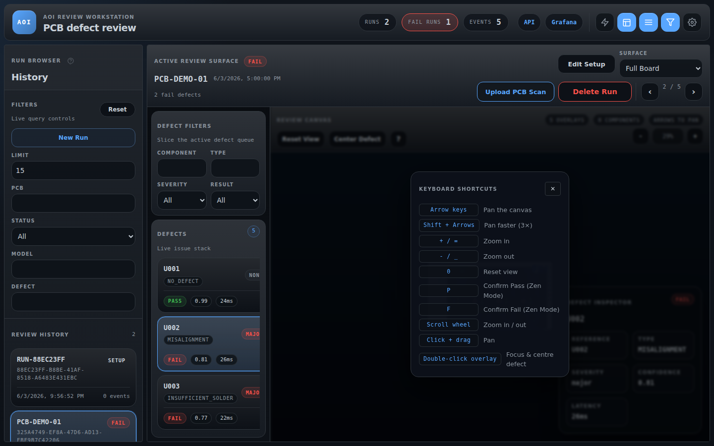
</p>

<p align="center">
  <em>The <strong>?</strong> button in the viewer toolbar opens this overlay listing all pan, zoom, and Zen Mode review bindings.</em>
</p>

### Zen Mode

<p align="center">
  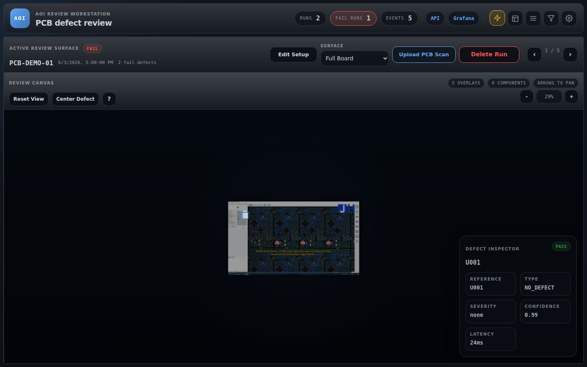
</p>

<p align="center">
  <em>Zen Mode collapses the run rail and sidebar and dims all non-selected overlays. Press <kbd>P</kbd> to confirm pass or <kbd>F</kbd> to confirm fail, then automatically advance to the next defect.</em>
</p>

### Topbar

<p align="center">
  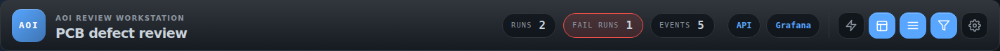
</p>

<p align="center">
  <em>Topbar: live summary stats (runs, fail count, events), theme toggle, and panel controls for run rail, sidebar, filters, and settings.</em>
</p>

The operator-facing flow in the repo today is:

1. Create a run
2. Upload a PCB scan
3. Configure setup requirements such as fiducials and barcode validation
4. Review generated or ingested defects in the workstation
5. Persist events and review history for traceability

## Architecture

### Backend

- `src/aoi/api/`: FastAPI routes for runs, events, health, setup, and image access
- `src/aoi/setup_service.py`: run setup state transitions and review-readiness logic
- `src/aoi/vision_service.py`: component detection, fiducial detection, normalization, and barcode helpers
- `src/aoi/database.py`: SQLite schema and persistence operations
- `src/aoi/log_manager.py`: JSONL event logging

### Frontend

- `web/src/components/`: review workspace, run rail, PCB viewer, setup flow, and settings
- `web/src/hooks/`: workspace state, run data fetching, and setup actions
- `web/src/styles/`: layout, viewer, control, and theme styling

### Supporting Stack

- `docker-compose.yml`: local multi-service stack
- `aoi-mock-sender`: synthetic event generator for development traffic
- `Grafana + Loki + Promtail`: log aggregation and dashboards

## Repository Layout

```text
src/aoi/               Python application
web/                   React frontend
tests/                 Backend test suite
docs/                  Architecture notes, UI references, and screenshots
ml/                    ML-related placeholders and requirements
docker-compose.yml     Local full-stack environment
```

## Quick Start

### 1. Backend

```bash
python3 -m venv .venv
source .venv/bin/activate
pip install -r requirements-dev.txt
PYTHONPATH=src python3 -m aoi.cli serve-http \
  --host 127.0.0.1 \
  --port 8000 \
  --output logs/inference.jsonl
```

Health check:

```bash
curl http://127.0.0.1:8000/health
```

### 2. Frontend

This project uses Node `22`.

```bash
export NVM_DIR="$HOME/.nvm"
. "$NVM_DIR/nvm.sh"
nvm use
cd web
npm install
npm run dev
```

Frontend URL: `http://127.0.0.1:5173`

### 3. Tests

```bash
pytest
```

## API Highlights

### Runs

- `POST /runs` creates a new inspection run
- `GET /runs` lists runs with filters such as `status`, `pcb_id`, and `defect_type`
- `GET /runs/{run_id}` returns one run with embedded defect data
- `PATCH /runs/{run_id}` updates setup-related run fields
- `DELETE /runs/{run_id}` removes a run and its stored scan assets

### Images and Setup

- `POST /runs/{run_id}/images` uploads the active PCB scan
- `GET /runs/{run_id}/images/{image_id}` serves the stored scan image
- `POST /runs/{run_id}/fiducials/detect` runs fiducial detection
- `POST /runs/{run_id}/fiducials/confirm` confirms detected fiducials
- `POST /runs/{run_id}/fiducials/manual` stores manually defined fiducials
- `POST /runs/{run_id}/barcode/detect` and related setup routes support barcode validation

### Events

- `POST /events` ingests inference events
- accepted payloads are written to `logs/inference.jsonl`
- accepted batches are also persisted into SQLite for run and defect review

Example event ingestion:

```bash
curl -X POST http://127.0.0.1:8000/events \
  -H 'Content-Type: application/json' \
  -d '{"events":[{"pcb_id":"PCB-0001","component_id":"R101","inspection_result":"FAIL","defect_type":"MISALIGNMENT","confidence_score":0.88,"inference_latency_ms":31}]}'
```

## Docker Stack

Run the full local environment:

```bash
docker compose up -d --build
```

Service URLs:

- API: `http://localhost:8000`
- Frontend: `http://localhost:5173`
- Grafana: `http://localhost:3000`
- Loki: `http://localhost:3100`

Grafana default credentials:

- Username: `admin`
- Password: `admin`

To stop the stack:

```bash
docker compose down
```

## Development Notes

- Python requirement: `3.11+`
- Frontend runtime: Node `22`
- Uploaded images are stored under the configured storage path, defaulting to `data/storage`
- Local SQLite data defaults to `data/aoi.db`
- Mock traffic can be generated with `PYTHONPATH=src python3 -m aoi.cli send-mock-events`
- Fresh README screenshots can be regenerated with `cd web && npm run capture:readme`

## Documentation

- [System architecture](docs/architecture.md)
- [API contract](docs/api_spec.md)
- [Database notes](docs/database.md)
- [Testing notes](docs/testing.md)
- [Troubleshooting manual](docs/troubleshooting_manual.md)
