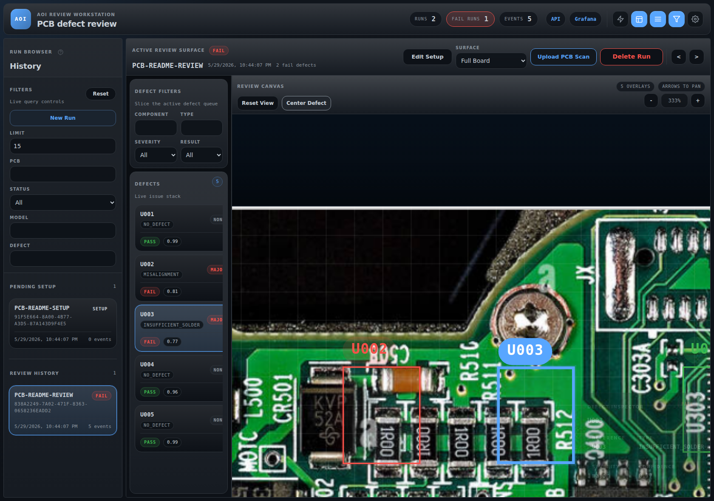
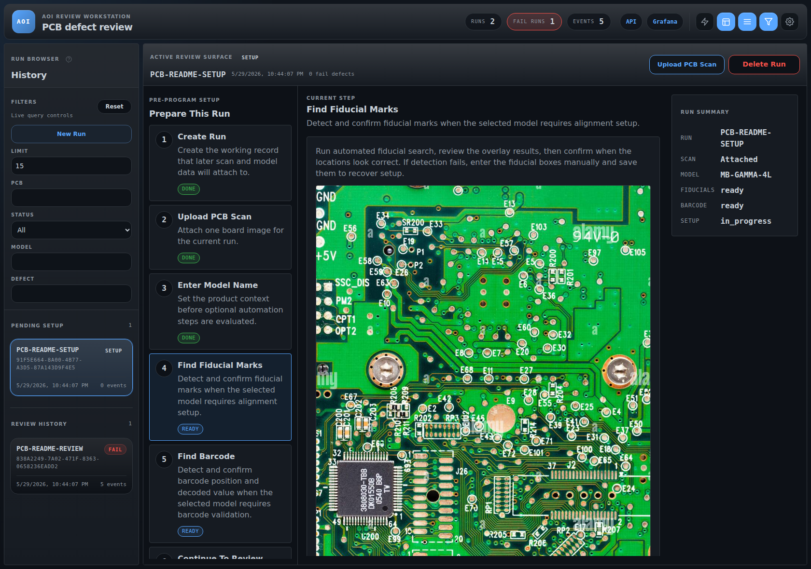

# AOI Review Workstation

An Automatic Optical Inspection (AOI) workstation for PCB review, setup validation, and event logging. This repository combines a FastAPI backend, a React review interface, SQLite persistence, and an observability stack for inspecting runs from image upload through defect review.


## Overview

The current project state includes:

- A FastAPI service for run creation, image upload, event ingestion, and run review APIs
- A React-based AOI review workstation with run history, defect filters, image viewer controls, and settings
- Setup-stage workflow support for model selection, fiducial detection, barcode handling, and review readiness
- Automatic component-candidate detection on uploaded PCB scans, with persisted overlays in setup and review
- SQLite-backed storage for `inspection_runs`, `defect_logs`, and uploaded scan assets
- JSONL event logging for downstream observability pipelines
- A local Docker stack with Grafana, Loki, and Promtail

## Current UI

<p align="center">
  
  
</p>

<p align="center">
  <em>Fresh captures from the live application: defect review and pre-program setup workflow.</em>
</p>

The operator-facing flow in the repo today is:

1. Create a run
2. Upload a PCB scan
3. Configure setup requirements such as fiducials and barcode validation
4. Review generated or ingested defects in the workstation
5. Persist events and review history for traceability

## Architecture

### Backend

- `src/aoi/api/`: FastAPI routes for runs, events, health, setup, and image access
- `src/aoi/setup_service.py`: run setup state transitions and review-readiness logic
- `src/aoi/vision_service.py`: component detection, fiducial detection, normalization, and barcode helpers
- `src/aoi/database.py`: SQLite schema and persistence operations
- `src/aoi/log_manager.py`: JSONL event logging

### Frontend

- `web/src/components/`: review workspace, run rail, PCB viewer, setup flow, and settings
- `web/src/hooks/`: workspace state, run data fetching, and setup actions
- `web/src/styles/`: layout, viewer, control, and theme styling

### Supporting Stack

- `docker-compose.yml`: local multi-service stack
- `aoi-mock-sender`: synthetic event generator for development traffic
- `Grafana + Loki + Promtail`: log aggregation and dashboards

## Repository Layout

```text
src/aoi/               Python application
web/                   React frontend
tests/                 Backend test suite
docs/                  Architecture notes, UI references, and screenshots
ml/                    ML-related placeholders and requirements
docker-compose.yml     Local full-stack environment
```

## Quick Start

### 1. Backend

```bash
python3 -m venv .venv
source .venv/bin/activate
pip install -r requirements-dev.txt
PYTHONPATH=src python3 -m aoi.cli serve-http \
  --host 127.0.0.1 \
  --port 8000 \
  --output logs/inference.jsonl
```

Health check:

```bash
curl http://127.0.0.1:8000/health
```

### 2. Frontend

This project uses Node `22`.

```bash
export NVM_DIR="$HOME/.nvm"
. "$NVM_DIR/nvm.sh"
nvm use
cd web
npm install
npm run dev
```

Frontend URL: `http://127.0.0.1:5173`

### 3. Tests

```bash
pytest
```

## API Highlights

### Runs

- `POST /runs` creates a new inspection run
- `GET /runs` lists runs with filters such as `status`, `pcb_id`, and `defect_type`
- `GET /runs/{run_id}` returns one run with embedded defect data
- `PATCH /runs/{run_id}` updates setup-related run fields
- `DELETE /runs/{run_id}` removes a run and its stored scan assets

### Images and Setup

- `POST /runs/{run_id}/images` uploads the active PCB scan
- `GET /runs/{run_id}/images/{image_id}` serves the stored scan image
- `POST /runs/{run_id}/fiducials/detect` runs fiducial detection
- `POST /runs/{run_id}/fiducials/confirm` confirms detected fiducials
- `POST /runs/{run_id}/fiducials/manual` stores manually defined fiducials
- `POST /runs/{run_id}/barcode/detect` and related setup routes support barcode validation

### Events

- `POST /events` ingests inference events
- accepted payloads are written to `logs/inference.jsonl`
- accepted batches are also persisted into SQLite for run and defect review

Example event ingestion:

```bash
curl -X POST http://127.0.0.1:8000/events \
  -H 'Content-Type: application/json' \
  -d '{"events":[{"pcb_id":"PCB-0001","component_id":"R101","inspection_result":"FAIL","defect_type":"MISALIGNMENT","confidence_score":0.88,"inference_latency_ms":31}]}'
```

## Docker Stack

Run the full local environment:

```bash
docker compose up -d --build
```

Service URLs:

- API: `http://localhost:8000`
- Frontend: `http://localhost:5173`
- Grafana: `http://localhost:3000`
- Loki: `http://localhost:3100`

Grafana default credentials:

- Username: `admin`
- Password: `admin`

To stop the stack:

```bash
docker compose down
```

## Development Notes

- Python requirement: `3.11+`
- Frontend runtime: Node `22`
- Uploaded images are stored under the configured storage path, defaulting to `data/storage`
- Local SQLite data defaults to `data/aoi.db`
- Mock traffic can be generated with `PYTHONPATH=src python3 -m aoi.cli send-mock-events`
- Fresh README screenshots can be regenerated with `cd web && npm run capture:readme`

## Documentation

- [System architecture](docs/architecture.md)
- [API contract](docs/api_spec.md)
- [Database notes](docs/database.md)
- [Testing notes](docs/testing.md)
- [Troubleshooting manual](docs/troubleshooting_manual.md)
