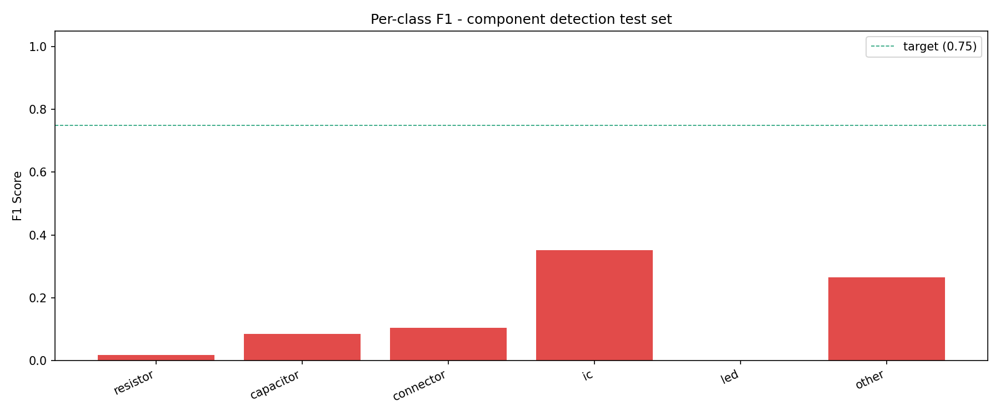

# Project Progress

Last updated: 2026-05-31

## Summary

The project is now beyond the UI/API scaffold stage and has a working first-pass component-detection training path.

Completed:

- FastAPI backend, React workstation UI, SQLite persistence, and setup/review workflow are in place
- Component-detection-first ML pipeline added alongside the original defect-first pipeline
- WACV 2019 PCB component annotations converted into a YOLOv8-ready board-level dataset
- Dataset taxonomy reduced to a higher-signal 6-class profile:
  - `resistor`
  - `capacitor`
  - `connector`
  - `ic`
  - `led`
  - `other`
- Automatic Markdown reporting added for dataset build, training, and evaluation runs

Current gap:

- The seed dataset is enough for a baseline, but not enough for deployment-grade performance
- Real AOI-line PCB images are still required to close the domain gap
- Defect detection remains a separate later-stage dataset/model task

## Latest Baseline

Dataset:

- Source: `docs/references/pcb_wacv_2019/pcb_wacv_2019`
- Profile: `reduced`
- Split: `33 train / 7 val / 7 test`

Test-set result from the reduced 6-class baseline:

- `mAP@50`: `0.0953`
- `mAP@50-95`: `0.0617`
- `precision`: `0.2057`
- `recall`: `0.1581`

Compared with the previous 20-class baseline:

- old `mAP@50`: `0.0044`
- new `mAP@50`: `0.0953`

This is still weak in absolute terms, but it is a meaningful improvement and confirms that reducing taxonomy complexity is the correct direction for the next iteration.

## Class-Level Signal

Strongest current classes:

- `ic`: AP50 `0.379`
- `other`: AP50 `0.109`
- `capacitor`: AP50 `0.053`

Still weak:

- `resistor`
- `connector`
- `led`

Interpretation:

- The model is learning some structure, especially for larger or more visually distinct packages
- Dense small-part classes still need more real data and better class balance
- `other` is useful as a temporary compression bucket while the real dataset is still small

## Charts

Latest reduced-baseline per-class F1 chart:

## Artifacts

Tracked run reports:

- `ml/reports/component_detection/20260531-150245Z-dataset.md`
- `ml/reports/component_detection/20260531-150610Z-train.md`
- `ml/reports/component_detection/20260531-150631Z-evaluate.md`

Latest model outputs:

- Best weight path: `ml/models/component_detection/best.pt`
- Eval chart source: `ml/models/component_detection/eval/f1_per_class.png`

## Recent Milestones

- `97529d8` Add FOV setup flow to review workspace
- `80d78d6` Run hybrid detection across full board and FOV crops
- `c941e21` Auto-enter FOV inspect mode for flagged defects
- `4cf8b58` Update: Clean up the dataset
- `a9b3a0e` Add: Component detection training and evaluation scripts, update README and requirements

## Next Steps

1. Capture real PCB images from the actual AOI setup
2. Label them with the current reduced taxonomy
3. Retrain the component detector on merged seed + real data
4. Re-evaluate whether `other` should remain collapsed or be split back into additional classes
5. Start a separate real-defect dataset path for defect detection after component localization is stable
